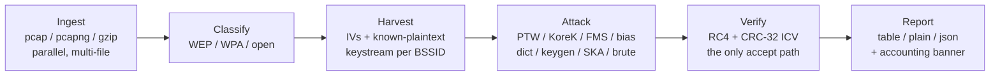

# Guide: Overview

WEPWolf turns a directory of captures into recovered WEP keys in one pass. This page walks the end-to-end workflow; the rest of the guide goes deeper on [the cryptography](how-it-works.md), [the attacks](attacks.md), [the output](output.md), and [tuning](tuning.md).

## The one-liner

```sh
wepwolf capture.cap
```

Point WEPWolf at a file or a directory. It scans every capture it finds, identifies the WEP networks, attacks each one, and prints the keys it recovers plus an accounting banner. With several access points present, they are cracked in parallel, and a key found on one network is reused against co-located networks that share it.

```sh
wepwolf /captures/                 # recurse a whole directory of captures
wepwolf a.pcap b.pcapng c.cap.gz   # several files at once (merged per BSSID)
wepwolf --bssid 00:11:22:33:44:55 capture.cap   # target one network
```

## The pipeline



### 1. Ingest

WEPWolf reads pcap, pcapng, and gzip-compressed captures over a range of radio link layers (raw 802.11, radiotap, Prism, AVS, PPI, Linux cooked), with tiered FCS recovery for malformed link headers. Files are processed **in parallel** on a work-stealing pool, and packets are streamed one at a time, so a multi-gigabyte capture is read with bounded memory -- the whole file is never loaded into RAM. The capture front-end is ported from the sibling WPA tool.

### 2. Classify

For every BSSID it sees, WEPWolf decides WEP / WPA / open from the beacon Privacy bit, any RSN or WPA information element, and the data-frame Extended-IV bit -- the same determination aircrack-ng makes. Only the WEP networks are attacked. The closing banner counts all of them.

### 3. Harvest

For each WEP frame, WEPWolf recovers keystream by XORing the ciphertext with **known plaintext**: the LLC/SNAP header that begins every 802.11 data frame, and -- where it can identify the encapsulated protocol -- the longer fixed headers of ARP, IPv4, IPv6 Neighbor Discovery, and EAPOL. Each `(IV, keystream)` pair, tagged with its WEP key slot, is the raw material the statistical attacks consume. See [How it works](how-it-works.md).

### 4. Attack

Each WEP network is run through every applicable attack, cheapest first, until one produces a key the verifier accepts. The cheap statistical and dictionary attacks run BSSID-parallel (the *sweep*), bounded by a per-network time budget so one hard network cannot starve the run; the optional 40-bit brute force runs one network at a time on the full machine (the *grind*). See [The attacks](attacks.md).

### 5. Verify

No attack declares victory on its own. Every candidate key is routed through one function that RC4-decrypts at least two retained frames and checks the transmitted CRC-32 ICV. Two independent agreements make a false accept negligible (~2⁻⁶⁴), so a reported key is correct -- the same bar aircrack-ng uses.

### 6. Report

WEPWolf prints the recovered keys, a WEP-focused table of the networks (most-IVs first), and an accounting banner reconciling every packet and every BSSID. Machine-readable `--plain` and `--json` modes are available, and `--carve` writes the exact WEP frames it cracked from into a standalone pcap. See [Output & diagnostics](output.md).

## What you need in the capture

WEP recovery is statistical, and reliability scales with the number of **distinct** IVs (WEP reuses its 24-bit IV heavily, so raw frame counts overstate the material). As a rule of thumb:

| Key length | Practical distinct-IV count |
|---|---|
| WEP-40 (5 octets) | a few thousand and up |
| WEP-104 (13 octets) | tens of thousands |
| WEP-232 (29 octets) | more still |

A capture below the floor is reported as "too thin" rather than spun on. If nothing cracks, that is almost always the reason; [Tuning & performance](tuning.md) and the [FAQ](../faq.md) explain how to tell, and `--debug` reports exactly how short a capture falls.

## Next

- [How it works](how-it-works.md) -- WEP, IVs, known plaintext, and the accept path.
- [The attacks](attacks.md) -- what each attack does and when it fires.
- [CLI Reference](../reference/cli.md) -- every option.
